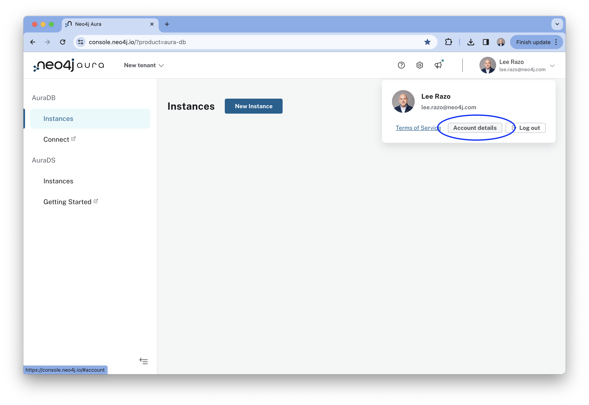
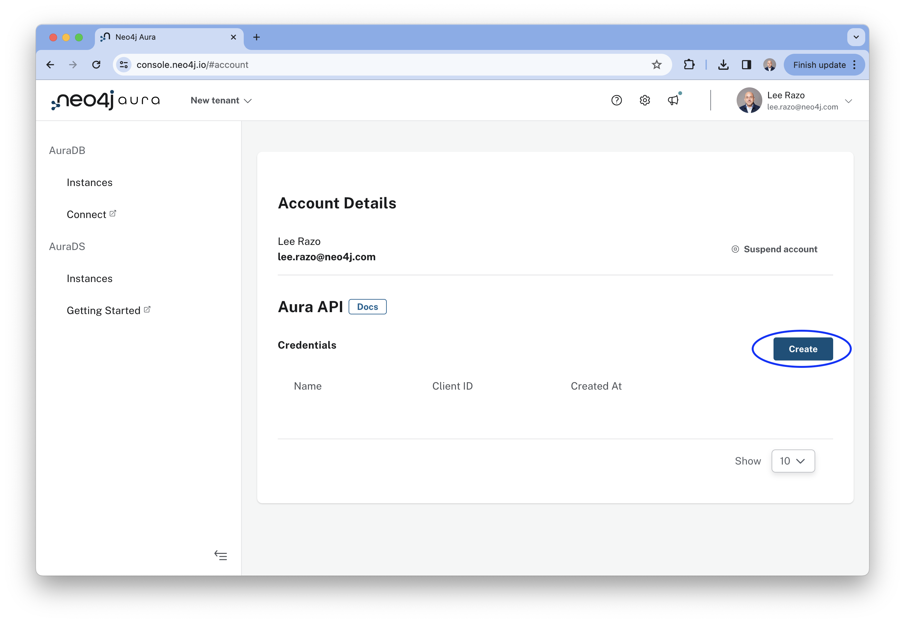
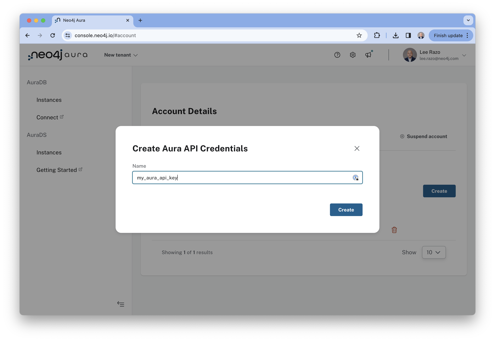
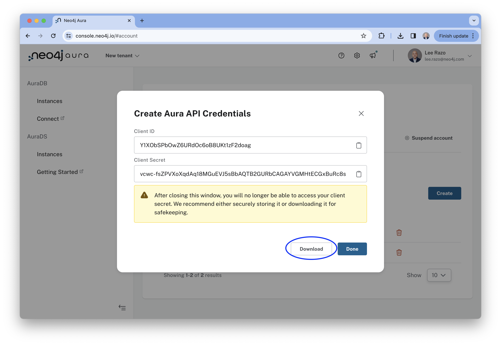

# Setting up API access for Neo4j Aura 

This guide will walk you through the steps for setting up API access for Neo4j Aura. 
Prerequisite: You will need a Neo4j Aura account set up either through one of the cloud marketplaces or directly from Neo4j. 

You can sign up for a new account at https://console.neo4j.io

### Step 1: Go to Account Details

Click on your picture in the upper right corner of the screen and then click the "Account Details" button from the pop up window that comes up.

### Step 2: Create a new API key

Click the "Create" button from the Account Details screen and give the new API key a unique name

### Step 3: **Download** the API credentials file to a location where these scripts will be able to access it later on.

### Congratulations!

Once you've completed these steps, you can move onto [the next part and start exploring](../02-using_aura_api/). 